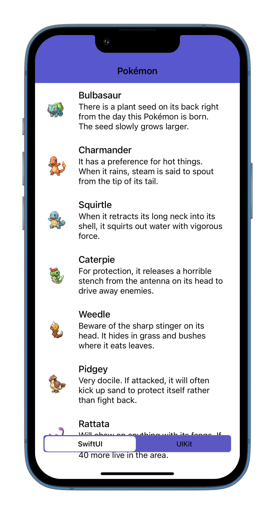
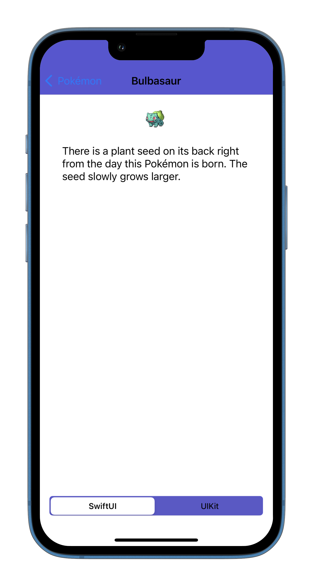
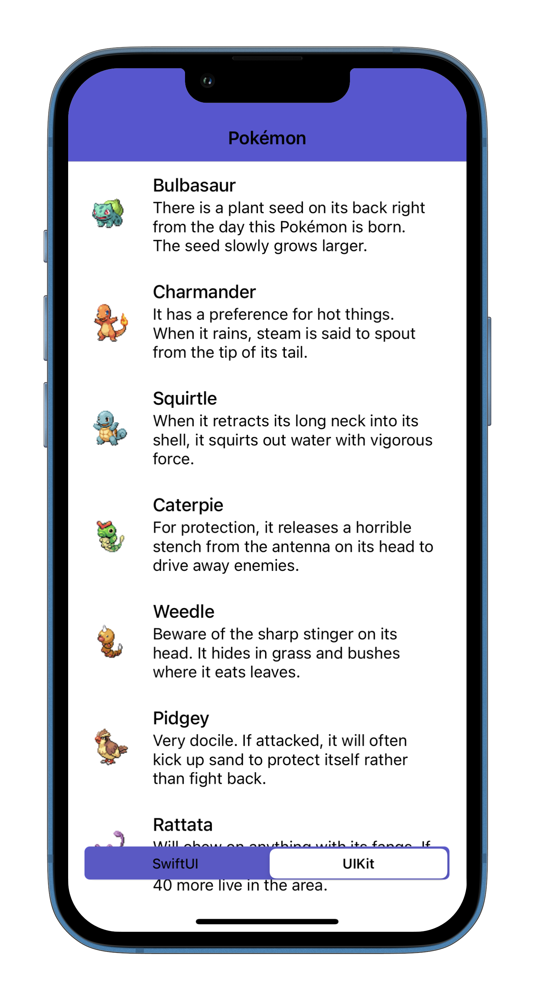
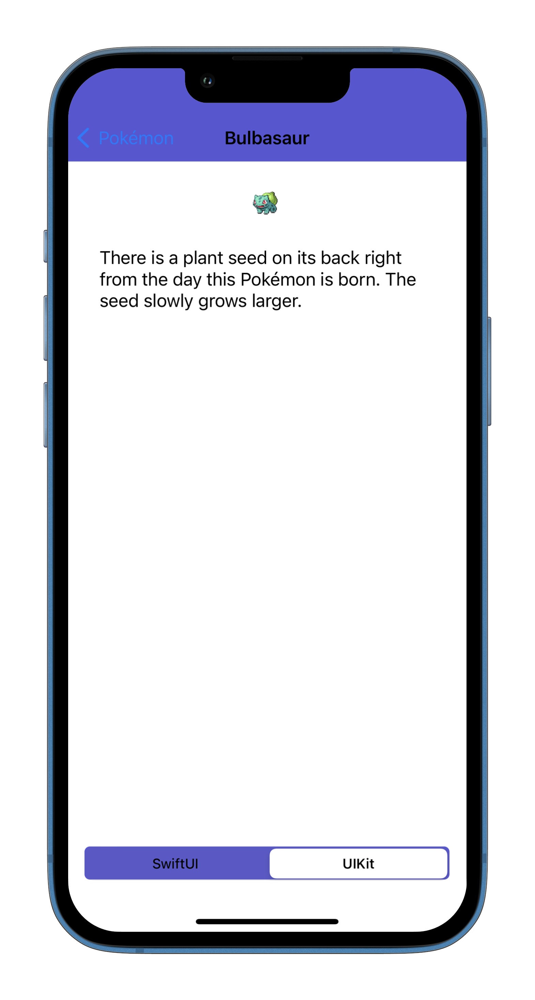

# SwiftUI and UIKit Interoperability Example

Single application with two versions of the screens (SwiftUI and UIKit)

## Description

- Pokemon List and Details view
- SwiftUI
- UIKit (.xib)
- MVVM pattern
- URLSession (JSON file)

## Screens

### SwiftUI

  

    
    
  

### UIKit

  

    
    
  

